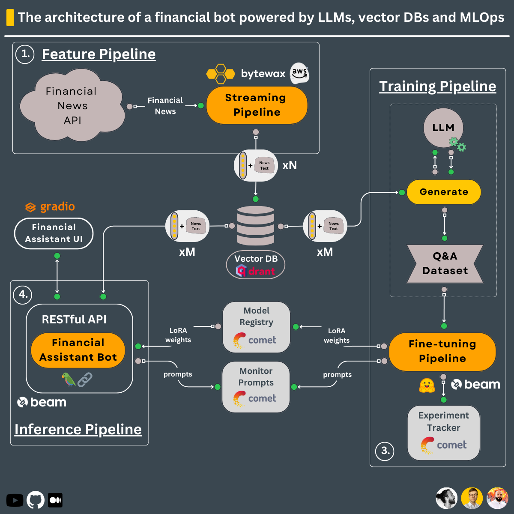

<div align="center">
    <h2>Hands-on LLMs</h2>
    <h1>Train and Deploy a Real-Time Financial Advisor</h1>
    <i>by <a href="https://github.com/iusztinpaul">Paul Iusztin</a> and <a href="https://github.com/Paulescu">Pau Labarta Bajo</a></i>
</div>

## Table of Contents

- [1. Building Blocks](#1-building-blocks)
- [2. Setup External Services](#2-setup-external-services)
- [3. Install & Usage](#3-install--usage)
- [4. Video lectures](#4-video-lectures)
- [5. License](#5-license)
- [6. Contributors & Teachers](#6-contributors--teachers)

------


## 1. Building Blocks

### Training pipeline
- [x] Fine-tune Falcon 7B using our own [Q&A generated dataset](/modules/q_and_a_dataset_generator/) containing investing questions and answers based on Alpaca News.
    - It seems that 1 GPU is enough if we use [Lit-Parrot](https://lightning.ai/pages/blog/falcon-a-guide-to-finetune-and-inference/)

### Real-time data pipeline
- [x] Build real-time feature pipeline, that ingests data form Alpaca, computes embeddings, and stores them into a serverless Vector DB.

### Inference pipeline
- [ ] REST API for inference, that
    1. receives a question (e.g. "Is it a good time to invest in renewable energy?"),
    2. finds the most relevant documents in the VectorDB (aka context)
    3. sends a prompt with question and context to our fine-tuned Falcon and return response.

<br/>




## 2. Setup External Services

Before diving into the modules, you have to set up a couple of additional tools for the course.

### 2.1. Alpaca
`financial news data source`

Follow this [document](https://alpaca.markets/docs/market-data/getting-started/), showing you how to create a FREE account, generate the API Keys, and put them somewhere safe.


### 2.2. Qdrant
`vector DB`

Go to [Qdrant](https://qdrant.tech/?utm_source=thepauls&utm_medium=partner&utm_content=github), create a FREE account, and follow [this document](https://qdrant.tech/documentation/cloud/authentication/?utm_source=thepauls&utm_medium=partner&utm_content=github) on how to generate the API Keys.


### 2.3. Comet ML
`ML platform`

Go to [Comet ML](https://www.comet.com/signup?utm_source=thepauls&utm_medium=partner&utm_content=github), create a FREE account, a project, and an API KEY. We will show you in every module how to add these credentials.


### 2.4. Beam
`cloud compute`

Go to [Beam](https://www.beam.cloud?utm_source=thepauls&utm_medium=partner&utm_content=github) and follow their quick setup/get started tutorial. You must create a FREE account, install their CLI and configure your credentials on your local machine.

- [Introduction guide](https://docs.beam.cloud/getting-started/introduction?utm_source=thepauls&utm_medium=partner&utm_content=github)
- [Installation guide](https://docs.beam.cloud/getting-started/installation?utm_source=thepauls&utm_medium=partner&utm_content=github)

#### Troubleshooting

When using Poetry, we had issues locating the Beam CLI when using it inside the Poetry virtual environment. To fix this, after installing Beam, create a symlink that points to Poetry's binaries, as follows:
 ```shell
  export COURSE_MODULE_PATH=<your-course-module-path> # e.g., modules/training_pipeline
  cd $COURSE_MODULE_PATH
  export POETRY_ENV_PATH=$(dirname $(dirname $(poetry run which python)))

  ln -s /usr/local/bin/beam ${POETRY_ENV_PATH}/bin/beam
 ```


 ### 2.5. AWS
 `cloud compute`

 Go to [AWS](https://aws.amazon.com/console/), create an account, and generate a pair of credentials.

 After, download and install their [AWS CLI](https://docs.aws.amazon.com/cli/latest/userguide/getting-started-install.html) and [configure it](https://docs.aws.amazon.com/cli/latest/userguide/cli-chap-configure.html) with your credentials.


## 3. Install & Usage
Every module has its dependencies and scripts. In a production setup, every module would have its repository, but in this use case, for learning purposes, we put everything in one place:

Thus, check out the README for every module individually to see how to install & use it:
1. [q_and_a_dataset_generator](/modules/q_and_a_dataset_generator/)
2. [training_pipeline](/modules/training_pipeline/)
3. [streaming_pipeline](/modules/streaming_pipeline/)
4. [inference_pipeline](/modules/financial_bot/)


### 3.1 Run Notebooks Server
If you want to run a notebook server inside a virtual environment, follow the next steps.

First, expose the virtual environment as a notebook kernel:
```shell
python -m ipykernel install --user --name hands-on-llms --display-name "hands-on-llms"
```
Now run the notebook server:
```shell
jupyter notebook notebooks/ --ip 0.0.0.0 --port 8888
```

## 4. Video lectures

### 4.0 Intro to the course

<div align="center">
  <a href="https://www.youtube.com/watch?v=l4HTEf0_s70">
      <p>Click here to watch the video 🎬</p>
    
  </a>
</div>


### 4.1 Fine-tuning our open-source LLM (overview)

<div align="center">
  <a href="https://www.youtube.com/watch?v=HcxwOYMmj40">
      <p>Click here to watch the video 🎬</p>
    
  </a>
</div>

### 4.2 Fine-tuning our open-source LLM (Hands-on!)

<div align="center">
  <a href="https://www.youtube.com/watch?v=RS96R0dH0uE">
      <p>Click here to watch the video 🎬</p>
    
  </a>
</div>

## 5. License

## 6. Contributors & Teachers


